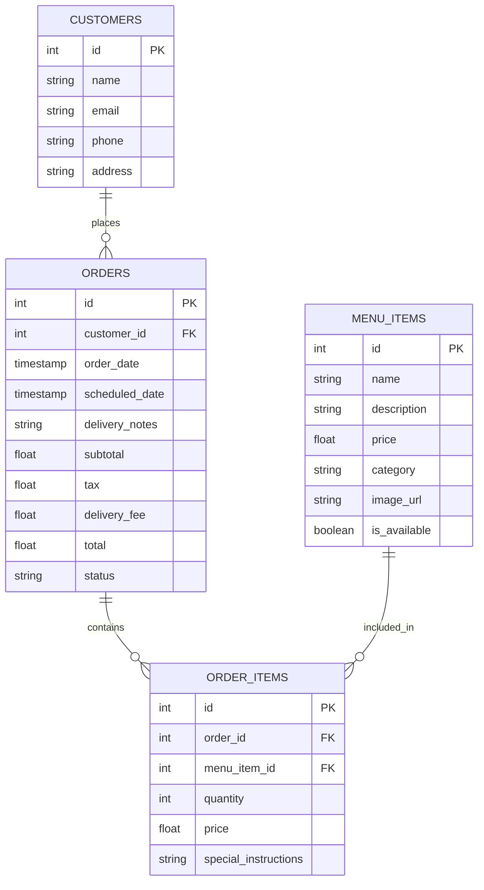

# Eel Bar Database - Entity Relationship Diagram

## Database Schema

## Tables Description

### Menu Items
The `menu_items` table stores information about all available food and beverage items.

| Column      | Type          | Description                                    |
|-------------|---------------|------------------------------------------------|
| id          | serial        | Primary key, auto-incremented                  |
| name        | varchar(255)  | Name of the item                               |
| description | text          | Detailed description of the item               |
| price       | decimal(10,2) | Price of the item                              |
| category    | varchar(100)  | Category (e.g., 'appetizer', 'main', 'beverage') |
| image_url   | text          | URL to the item's image                        |
| is_available| boolean       | Whether the item is currently available        |

### Customers
The `customers` table stores customer contact and delivery information.

| Column      | Type         | Description                                    |
|-------------|--------------|------------------------------------------------|
| id          | serial       | Primary key, auto-incremented                  |
| name        | varchar(255) | Customer's full name                           |
| email       | varchar(255) | Customer's email address                       |
| phone       | varchar(20)  | Customer's phone number                        |
| address     | text         | Delivery address                               |

### Orders
The `orders` table tracks all customer orders and their status.

| Column         | Type          | Description                                     |
|----------------|---------------|-------------------------------------------------|
| id             | serial        | Primary key, auto-incremented                   |
| customer_id    | integer       | Foreign key to customers table                  |
| order_date     | timestamp     | Date and time when the order was placed         |
| scheduled_date | timestamp     | Optional delivery date and time                 |
| delivery_notes | text          | Special instructions for delivery               |
| subtotal       | decimal(10,2) | Sum of all items before tax and fees            |
| tax            | decimal(10,2) | Tax amount                                      |
| delivery_fee   | decimal(10,2) | Delivery fee                                    |
| total          | decimal(10,2) | Total order amount including tax and fees       |
| status         | varchar(50)   | Order status ('pending', 'preparing', etc.)     |

### Order Items
The `order_items` table connects orders with specific menu items.

| Column               | Type          | Description                                     |
|----------------------|---------------|-------------------------------------------------|
| id                   | serial        | Primary key, auto-incremented                   |
| order_id             | integer       | Foreign key to orders table                     |
| menu_item_id         | integer       | Foreign key to menu_items table                 |
| quantity             | integer       | Number of items ordered                         |
| price                | decimal(10,2) | Price per item at time of order                 |
| special_instructions | text          | Special instructions for this specific item     |

## Relationships

1. A **Customer** can place many **Orders** (one-to-many)
2. An **Order** contains many **Order Items** (one-to-many)
3. A **Menu Item** can be included in many **Order Items** (one-to-many)

## Database Indexes

- Primary key indexes on all tables (id columns)
- Foreign key indexes on:
  - orders.customer_id
  - order_items.order_id
  - order_items.menu_item_id
  
## Constraints

- **Foreign Key Constraints**:
  - orders.customer_id references customers.id
  - order_items.order_id references orders.id
  - order_items.menu_item_id references menu_items.id
  
- **Not Null Constraints**:
  - All primary keys
  - All required fields (name, price, email, etc.)
  
- **Default Values**:
  - orders.order_date defaults to the current timestamp
  - orders.status defaults to 'pending'
  - menu_items.is_available defaults to TRUE 