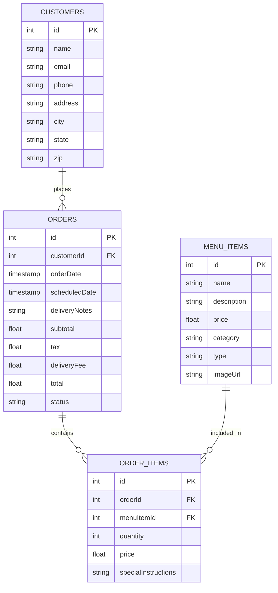

# Eel Bar Database - Entity Relationship Diagram

## Database Schema

## Tables Description

### Menu Items
The `menu_items` table stores information about all available food and beverage items.

| Column      | Type        | Description                                    |
|-------------|-------------|------------------------------------------------|
| id          | serial      | Primary key, auto-incremented                  |
| name        | text        | Name of the item                               |
| description | text        | Detailed description of the item               |
| price       | double      | Price of the item                              |
| category    | text        | Category ('eel' or 'beverage')                 |
| type        | text        | Specific type (e.g., 'smoked', 'grilled')      |
| imageUrl    | text        | URL to the item's image                        |

### Customers
The `customers` table stores customer contact and delivery information.

| Column      | Type        | Description                                    |
|-------------|-------------|------------------------------------------------|
| id          | serial      | Primary key, auto-incremented                  |
| name        | text        | Customer's full name                           |
| email       | text        | Customer's email address                       |
| phone       | text        | Customer's phone number                        |
| address     | text        | Street address                                 |
| city        | text        | City                                           |
| state       | text        | State or province                              |
| zip         | text        | Postal code                                    |

### Orders
The `orders` table tracks all customer orders and their status.

| Column         | Type        | Description                                     |
|----------------|-------------|-------------------------------------------------|
| id             | serial      | Primary key, auto-incremented                   |
| customerId     | integer     | Foreign key to customers table                  |
| orderDate      | timestamp   | Date and time when the order was placed         |
| scheduledDate  | timestamp   | Optional delivery date and time                 |
| deliveryNotes  | text        | Special instructions for delivery               |
| subtotal       | double      | Sum of all items before tax and fees            |
| tax            | double      | Tax amount                                      |
| deliveryFee    | double      | Delivery fee                                    |
| total          | double      | Total order amount including tax and fees       |
| status         | text        | Order status ('pending', 'preparing', etc.)     |

### Order Items
The `order_items` table connects orders with specific menu items.

| Column              | Type        | Description                                     |
|---------------------|-------------|-------------------------------------------------|
| id                  | serial      | Primary key, auto-incremented                   |
| orderId             | integer     | Foreign key to orders table                     |
| menuItemId          | integer     | Foreign key to menu_items table                 |
| quantity            | integer     | Number of items ordered                         |
| price               | double      | Price per item at time of order                 |
| specialInstructions | text        | Special instructions for this specific item     |

## Relationships

1. A **Customer** can place many **Orders** (one-to-many)
2. An **Order** contains many **Order Items** (one-to-many)
3. A **Menu Item** can be included in many **Order Items** (one-to-many)

## Database Indexes

- Primary key indexes on all tables (id columns)
- Foreign key indexes on:
  - orders.customerId
  - order_items.orderId
  - order_items.menuItemId
  
## Constraints

- **Foreign Key Constraints**:
  - orders.customerId references customers.id
  - order_items.orderId references orders.id
  - order_items.menuItemId references menu_items.id
  
- **Not Null Constraints**:
  - All primary keys
  - All required fields (e.g., name, price, email, etc.)
  
- **Default Values**:
  - orders.orderDate defaults to the current timestamp
  - orders.status defaults to 'pending' 